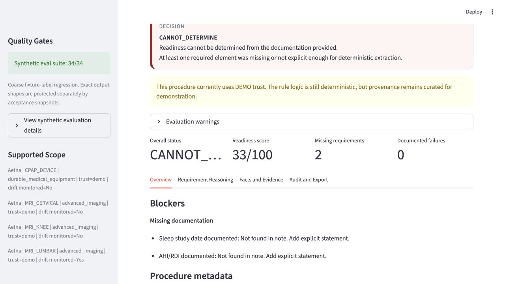

# Nicholas Leko

**Healthcare operations → healthcare AI product.**

I build AI tools for the healthcare workflows I’ve worked inside: payer operations, ED intake, clinical administration, and medical-device program readiness.

My focus is healthcare AI that survives real implementation: prior authorization readiness, clinical AI evaluation, workflow automation, auditability, refusal states, and failure-mode analysis.

[LinkedIn](https://www.linkedin.com/in/nicholas-leko/) · [GitHub Repositories](https://github.com/NickLeko?tab=repositories) · [nicholas.leko99@gmail.com](mailto:nicholas.leko99@gmail.com)

---

## Start here

### [Prior Authorization Readiness Copilot](https://github.com/NickLeko/PriorAuthorizationCopilot)

Most prior authorization friction is operational before it is clinical: missing documentation, unclear requirements, payer-rule variation, policy drift, and handoff failure.

This project is a deterministic readiness workflow that checks prior-auth documentation against versioned payer rules before submission. It uses requirement-level evidence mapping, structured review states, audit artifacts, and refusal-first logic.

**Key features**

* READY / NOT_READY / CANNOT_DETERMINE review states
* Versioned payer rules
* Evidence-span traceability
* Policy source change detection
* Rulebook promotion controls
* Model card and failure-mode analysis
* Streamlit, FastAPI, and CLI surfaces

**Tech:** Python, FastAPI, Streamlit, YAML rules engine

---

### [Clinical AI Eval Sandbox](https://github.com/NickLeko/clinical-AI-eval_sandbox)

Before a healthcare organization deploys an LLM into clinical-adjacent workflows, someone has to ask: where does it fail, when does it overstate, and how do we know?

This project is a safety-oriented evaluation harness for LLM behavior in clinical decision-support scenarios. It evaluates groundedness, citation fidelity, uncertainty calibration, refusal behavior, and failure modes across structured clinical cases.

**What it demonstrates:** AI evaluation design, safety testing, reviewer-facing reporting, and practical judgment around clinical-adjacent use cases.

**Key features**

* Structured scoring for groundedness and citation fidelity
* Uncertainty and refusal-behavior evaluation
* Negation-aware safety checks
* Multi-provider generation support
* Reproducible benchmark artifacts
* Run provenance and reviewer-facing reports

**Tech:** Python, OpenAI / Anthropic / Gemini APIs, CI/CD pipeline

---

### [ICU Early Warning Model](https://github.com/NickLeko/icu-code-blue-early-warning)

Clinical prediction tools do not fail only because the model is weak. They fail because alert policy, workflow fit, trust, and deployment constraints are ignored.

This project is a retrospective ICU risk-modeling artifact using eICU data with hospital-level holdout validation, fixed alert-budget framing, model-card documentation, and explicit limitations around clinical deployment.

**What it demonstrates:** risk modeling literacy, alert-policy thinking, calibrated claims, and the difference between predictive signal and deployable clinical product.

**Key features**

* Hospital-level holdout validation
* Fixed alert-budget evaluation
* Risk enrichment framing
* Model card and limitations documentation
* Explicit non-claims around clinical deployment

**Tech:** BigQuery ML, SQL, Python, eICU-CRD

---

## How I work

I prefer deterministic systems before probabilistic ones, refusal states over confident guesses, and product scope before model demos.

My projects are built around:

* Clear workflow boundaries
* Human-review assumptions
* Auditability
* Failure-mode analysis
* Explicit non-claims
* Reproducible evaluation artifacts
* Implementation risk, not just model performance

These are self-directed prototypes, not deployed clinical products. They are meant to show healthcare workflow judgment, implementation awareness, and the ability to build and evaluate AI tools in regulated environments.

---

## Background

I have worked across healthcare operations, payer workflows, clinical intake, and healthcare program administration.

* **Stryker:** AED program administration, operational readiness, compliance workflows, customer onboarding, field-issue synthesis, and platform feedback across 300+ enterprise AED programs.
* **Blue Cross Blue Shield of Texas:** Small-group payer account management as part of a team supporting 60,000+ employer accounts, with exposure to retention strategy, claims/CRM analysis, HIPAA-aware operations, and payer-provider friction.
* **HCA Los Robles Hospital:** Emergency department registration, patient intake, clinical documentation workflows, and high-acuity operational environments.
* **Ventura Orthopedics:** Physical therapy operations, patient scheduling, documentation support, and care coordination workflows.

This background shapes the way I build: not as abstract AI demos, but as workflow artifacts designed around real operational failure points.

